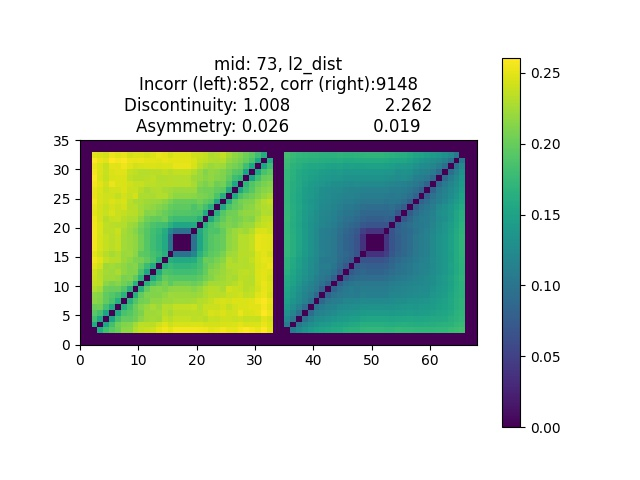

# ML4ML: automated invariance testing for machine leanring models
ML4ML invariance testing: [Paper](https://arxiv.org/abs/2109.12926) | [Model Repository](https://drive.google.com/drive/folders/1kFPRBxmqcFKX_VSEKyE54gPluiPCD9fN?usp=sharing) | [Metadata](https://drive.google.com/drive/folders/1zQc9axs95XQzpSPT-ztoCT2ht3KuDz8S?usp=sharing)

Authors: [Zukang Liao](https://scholar.google.com/citations?user=1N8pGXoAAAAJ&hl=en), [Pengfei Zhang](https://scholar.google.com/citations?user=CIDjqxYAAAAJ&hl=en), [Min Chen](https://sites.google.com/site/drminchen/)

General guideline to run the code:

### (1). Standard CNN training (train.py)

A series of CNNs on either MNIST or CIFAR or other databases should be trained in advance. We use the code train.py to train many CNNs using the metadata specify in metadata.txt.
    
After the CNNs are trained, we use model id (mid) to record them.

### (2). Model database (model.py)

Our model database consists of 4 different partitions:
- partition (a): mid: 1-100, t1-t50. VGG13bn trained on CIFAR for rotation testing.
- partition (b): mid: 101-200, t101-t150. VGG13bn trained on CIFAR for brightness testing.
- partition (c): mid: 201-300, t201-t250. VGG13bn trained on CIFAR for scaling testing.
- partition (d): mid: 301-400, t301-t350. CNN5 trained on MNIST for rotation testing.
	    
Mid starting with "t" is a hold-out set. When using three-fold cross validation, the hold-out set is always treated as one fold, while the rest 100 "regular" models are randomly split into two folds.

Notes: Model 1 to 15 are trained on CPU, other models are trained on GPU. Model 101 to 200, t101 to t150: preprocessing -- normalised to [0, 1], Others: [-0.5, 0.5]

### (3). Invariance testing data (save_invariance_results.py)
For a given CNN (named "mid.pth" - mid short for model id, e.g., "1.pth"), please run:

    python save_invariance_results.py --mid=1 --aug_type=r

    
where mid is the index of the CNN and aug_type: "r" for "rotation", "s" for "scaling" and "b" for "brightness". The script will generate two .npy files, namely test_results1515.npy (CONF) and test_actoverall1515.npy (CONV).
    
For partition (d), please specify --dbname=mnist:

    python save_invariance_results.py --mid=mid --aug_type=r --dbname=mnist

### (4). Variance matrices (matrices_CONF.py and matrices_CONV.py)
To generate variance matrices (CONF):

    python matrices_CONF.py --mid=mid --aug_type=r

    
To generate variance matrices (CONV):

    python matrices_CONV.py --mid=mid --aug_type=r

- Example at CONF level

### (5). Measurements (measurements.py)
To generate a json file consisting of all measurements for the model:

    python measurements.py --mid=mid --aug_type=r
 
    
For partition (d), please specify --dbname=mnist:

    python measurements.py --mid=mid --aug_type=r --dbname=mnist

    
### (6). ML4ML assessors (ML4MLassessor.py)
To train an ML4ML assessor with different types of ml algorithms. And test the performance of the assessor on the testing set of the model-database.

    python ML4MLassessor.py --aug_type=r --dataset=1
 
    
For partition (d), please specify --dbname=mnist:

    python ML4MLassessor.py --aug_type=r --dbname=mnist --dataset=1
    
Specify --dataset=1 for the first time runing the script.

